# Creating a highly available Wordpress application on the IBM Cloud

IBM Cloud™ comprises over 60 [data centers](https://www.ibm.com/cloud/data-centers/) around the world.  Additionally, IBM Cloud includes 6 multi-zone regions ([MZR](https://cloud.ibm.com/docs/infrastructure/loadbalancer-service?topic=loadbalancer-service-multi-zone-region-mzr-overview)) where at least 3 geographically dispersed and independent data-centers can be clustered together over a very high-speed, low-latency network to provides the infrastructure for highly available applications.  Within these MZRs, you can create your own Virtual Private Cloud ([VPC](https://cloud.ibm.com/docs/vpc-on-classic?topic=vpc-on-classic-about)), which  provides a software define network within the IBM public cloud.  VPC gives you the security of a private cloud with the agility and ease of use as a public cloud.

This tutorial will walk thru creating a custom Virtual Private Cloud (VPC) within an MZR of the IBM Public Cloud.  We will cover the following topics:
1.  Create a custom Gen2 VPC from scratch using the IBM Cloud UI.
2.  Creating custom subnets with BYOIP (Bring your own IP).
3.  Creating custom x86 and Power9 Virtual Server Instances (VSI) within this VPC.
4.  Creating a 3-node active-active clustered MariaDB database with Galera.
5.  Creating a 3-node active-active clustered Wordpress application using GlusterFS.
5.  Verifying high availability and scalability of the VSIs within the MZR.

## Architecture
The following diagram depicts the topology of what you will build in this tutorial.  You'll note the topology includes multiple zones which include multiple subnets, which are isolated by zones and logical tiering with security groups to protect what traffic is allowed into and out of the VSIs within these subnets.  While this tutorial focuses on a single MZR, which provides a great deal of resilency from any single point of failure (SPOF), it does not address a complete city outage such as a natural disaster.  For Disaster Recovery scenarios, it is recommended to deploy your application across two or more MZRs as described in this [article](https://cloud.ibm.com/docs/tutorials?topic=solution-tutorials-strategies-for-resilient-applications).


* 3X redundancy is needed to achieve [99.999% availability](https://www.ibm.com/garage/method/practices/run/cloud-platform-for-ha) (i.e. <5m per year).
* IBM zones within an MZR are isolated from other zones and provide complete redundancy from other zones within an MZR (i.e. there is no single-point-of-failure across zones).
* 3 nodes is often recommended for many clustering services (e.g. MariaDB Galera, VMWare, Kubernetes, etc.).

# Part 1 - Creating a cross MZR VPC with custom subnetting


## Software Defined Networking with a Virtual Private Cloud
IBM Cloud™ Virtual Private Cloud (VPC) is a virtual network within your Cloud account.  It provides fine-grained security, multi-tenant isolation, and network traffic segmentation.  Each VPC is deployed to a single region; however, a VPC can span multiple zones (i.e. Data-centers).  For example, in an MZR with 3 data-centers, your VPC can span all 3 data-centers providing a logical network that sits on top of multiple physical networks across these data-centers.  This allows you to recreate your own premise network (e.g. 10.10.x.x or 192.168.x.x) without conflicting with other tenants that use these same IP addresses within their custom VPC.  This makes migrating to IBM Cloud easier and reduces risk associated with changing your application's underlying network.  


### 1. Create a private virtual cloud (VPC).
The IBM Cloud is constantly adding new features and services, which is why you will see multiple Virtual Server Instance (VSI) options:  
- Classic VSIs where you'll find VLAN segregated servers, bare metal servers, VMWare servers, SAP servers, etc.
- Generation 1 VPC VSIs
- Generation 2 VPC VSIs

This tutorial will use Gen2 VPC VSIs.

1.  Login to the IBM Cloud and click the **hamburger stack**, then select **VPC Infrastructure** ([VPC](http://cloud.ibm.com/vpc-ext/overview)) followed by **Create VPC for Gen 2**. 

2.  Fill in values for the **New virtual private cloud** wizard:  
	* Enter a name for your new VPC (e.g. ``us-south-dev-vpc``).
	* Choose a **Resource group**.   *Learn more [here.](https://cloud.ibm.com/docs/resources?topic=resources-bp_resourcegroups)*
	* Add **tags** to organize your team, project, function, etc.  *Learn more [here.](https://cloud.ibm.com/docs/resources?topic=resources-tag)*
	* Select the **region** for the VPC.  *VPCs are tied to regions.*
	* Leave **Allow SSH** and **Allow ping** for now -- *you can remove these rules once you get connectivity working.*
	* Uncheck **Create a default prefix for each zone** since you will create your own subnet.
	* Click the **Create virtual private cloud** button.

		

### 2.  Configure VPC defaults.  
The VPC defaults are designed for simplicity in getting started and may require modification for a production environment where security is paramount.  

1. Drill into your newly created VPC.
	* Click the **Default ACL** link if you wish to change the name to something more descriptive (e.g. ``default-nacl``).
	* Click the **Default Security Group** link to change the name (e.g. ``web-security-group``).
2. Click the **Manage address prefixes** link followed by the **New prefix** link.
3. Add IP range CIDR block addresses per the Architecture diagram.
	* Note: Using a subnet naming convention makes it easier to remember the IP addresses.  For example, using 10.10.10.0 for Dallas1 and then 10.10.20.0 for Dallas2. Use what works for you, but consistency and a standard makes it easier with communicating to the team.

4. Click the **Overview** breadcrumb link to return to the main VPC page.

### 3.  Create subnets for your VPC.  
Isolating VSIs to separate subnets allows easier firewalling and protection (e.g. only allow DB connections to the DB subnet and only from the web-tier subnet).  Also, note that subnets can't span zones.

1. Click the **New subnet** button to launch the Subnet wizard.
2. Change your data-center to match the data-center you used for your addresss prefixes. (e.g. ``Dallas1``)
3. Enter a name for the web-tier subnet such as the architecture diagram depicts. (e.g. ``web1``)
4. Add the subnet to your resource group to make management of your IBM Cloud services easier.
5. Select the **Address prefix** that matches the Architecture diagram. (e.g. ``web1`` uses ``10.10.10.0/24``)
6. Select **Attached** for the Public gateway so you have outbound connectivity to the Internet (e.g. to get OS patches).  
7. Click the **Create subnet** button.
8. Repeat this section for the 5 other subnets in the Architecture diagram.
9. Click the **VPC Layout** link and select your VPC in the drop-down.  
10. Click each subnet box and examine the subnet names, IP address ranges, data-center location, and public Gateway IP address.
	
	* Notice how the subnets within a zone use the same Public Gateway.

### 4.  Create security groups for the Database tier.  
Network Interface Cards (NICs) within VSIs are attached to security groups and allow you to filter what traffic is allowed into the VSI.  By default, all traffic is blocked, so you'll need to open up specific ports depending on what services within the VSI you wish to expose to other computers.  A really helpful feature is the ability to allow VSIs that are attached to other security groups to connect (e.g.  only allow the web-tier VSIs to connect to the db-tier VSIs.)  You can read more about security groups [here](https://cloud.ibm.com/docs/vpc?topic=vpc-using-security-groups).

1.  From the left-side **VPC Menu**, select the **Security groups** menu item and click the **new security group** link so you can add a different security group for the database tier. *You can just use the default security group for the web tier.*
2.  Enter a name for the security group (e.g. ``db-security-group``).
3.  Ensure the correct VPC is selected as well as the desired Resource group, then click the **New rule** link for the **Inbound rules** section.
4.  Choose **TCP** as the Protocol, then select the **Port range** radio button and enter ``22`` for both the Port min and the Port max (*port 22 is to allow SSH connections*).
5.  Next, select the **Security group** radio button for the Source type of the rule and choose your default security group, then click the **Save** button.
	* Tip:  this rule means that VSIs protected by this security group will allow SSH connections from other VSIs that are protected by the default security group. (i.e. only allow SSH to the DBs from the web VSIs.)
6.  Click the Inbound **New rule** link again and enter ``3306`` (*MYSQL Database port*) for Port min and Port max and again select your default security group as the Source type.
7.  Add another Inbound rule for **ICMP** (*so you can ping the VSIs*) traffic from any VSI that is attached to the default security group and click **Save**. 
8.  Click the Outbound **New rule** link and choose **All** Protocols from **Any** Destination type to permit all outbound traffic from VSIs protected by this security group.
9.  Once the rules are correct, click the **Create security group** button.


 
## Virtual Server Instances  
Now that you have a VPC created, you can provision Gen2 VSIs within your custom network.  These new VSIs provision rapidly (usually in seconds) and have very high-speed networking (e.g. 100Gbps).  Additionally, IBM Power hardware is available in Beta, which is particularly good at multi-threaded applications as the CPU includes 2X the threads per core as x86 CPUs, making it more cost effective for multi-threaded applications like DBs, AI jobs, Apache Spark, etc.  You can read more [here](https://cloud.ibm.com/docs/vpc?topic=vpc-about-advanced-virtual-servers).

### 1. Create a VSI for each subnet
1.  Select the **VPC layout** menu item of the VPC left-side menu and choose your VPC.
2.  Select each subnet of the VPC and resize the window so you can see the subnets stacked.
3.  Click the **ellipsis** in the corner of each subnet and choose **New instance**.
4.  Fill in the details for the **New virtual server for VPC** wizard.
	*  Enter a name (e.g. ``db1``).
	*  Ensure the correct **VPC** is selected.
	*  Choose your desired **resource group**.
	*  Add any desired **Tags**.
	*  Choose the **data-center** that matches the diagram (e.g. ``Dallas1``).
	*  For the web-tier, choose **x86** as the chipset.  For the data-tier, choose **POWER**.
	*  Choose **Ubuntu 18.04** for the Operating System Image.
	*  Choose the **2 vCPUs by 8GB RAM** Balanced profile. 
	*  Click **New key** if your SSH key hasn't been added already; otherwise, just select your existing SSH key.
		* Fill in the **Add SSH Key** Wizard if needed.
	*  Leave the Boot volume and Data volume defaults for the database VSIs, but click the **pencil** icon for the ``eth0`` network interfaces and ensure the correct Subnet is selected (e.g. ``web1`` for web1 in the first data-center and ``web2`` for web2 in the second data-center of your VPC.)
	*  Ensure the correct **Security group** is checked (*See the Architecture diagram if unclear.*).
	*  Click the **Create virtual server instance** button.


	* Note:  the VSI provisions very rapidly (*usually in under 1 minute*).
	* Also note the POWER VSIs are cheaper than x86 since the HW is more performant.

5.  Repeat step 4 for each VSI in the architecture diagram (i.e. ``web1..web3``, ``db1..db3``).
	* For the ``web`` servers, you need to add a **Data volume** for the Wordpress files.
	* Name the volume something descriptive (e.g. ``web1-www-vol``) using the ``Tiered`` profile.
	* Enter ``100`` for the volume size (i.e. 100GB) and select the default ``3 IOPS/GB``.
	* To prevent forgetting to delete this volume, click the **Enabled** toggle for the **Auto Delete** followed by the **Attach** button.
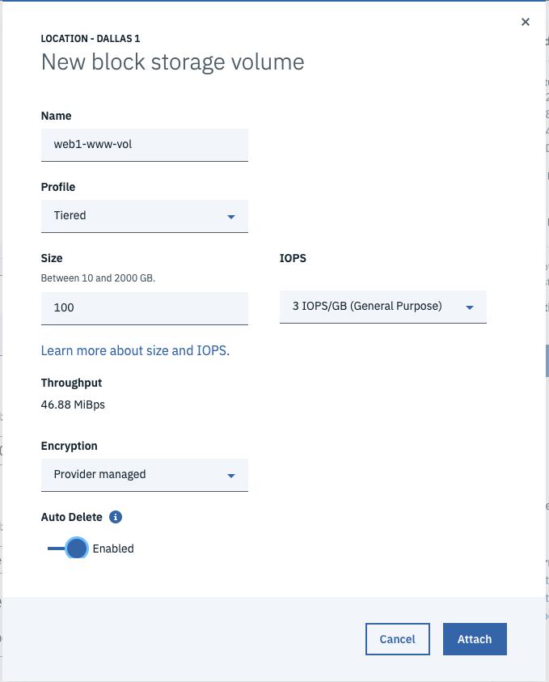
6.  Click the **VPC layout** link followed by selecting each subnet to see the details of the VSIs within the appropriate subnets.  

7.  Click the **Reserve** link for a new **Floating IP** for the **web1** instance so you can SSH into the VSI.
	* TIP:  VSIs don't have public IP addresses by default which is more secure; however, getting to the VSI without a public IP requires VPN or a jump server or Direct Link, etc. which is beyond the scope of this tutorial.  For a production setup, the author recommends a much more hardened security architecture.
	* We'll use ``web1`` as the jumpserver to the other VSIs.

### 2.  Test connectivity across the VPC
Now that you have VSIs provisioned within isolated subnets within your VPC, you will remotely login to one of your VSIs that has a floating public IP address and then test connectivity to all of the other VSIs within the VPC.

1.  Copy the **Floating IP** from the ``web1`` VSI that you just created and pull up a command-line terminal program (e.g. *Terminal* in MacOS or *Putty* in Windows).
2.  Connect to the VSI using an ssh login (e.g. ``# ssh root@52.116.128.59``).  
  

3.  Ping each VSI's private IP in the VPC.  
  
	* Notice you can ping all private IP addresses (i.e. ``10.10.x.4``) out-of-the-box without setting up any explicit routes.  IBM's VPC uses an implicit router to route traffic across your VPC.
4.  Exit out of ``web1`` and SSH into ``db1`` using ``web1`` as a *jump server* (e.g. ``ssh -J <user>@<jump-server> <user>@<target-server>``) which uses your local private SSH key with the public SSH key that was added to each VSI.  

	* Notice that the DB server doesn't have a public IP address, so you jumped thru the *Floating IP* of the ``web1`` and then into the *private IP* address of the DB server.
5.  Ping Google's DNS address ``8.8.8.8`` to verify that you have outbound connectivity thru the *Public Gateway* that you attatched to your subnet.  
6.  Do a ``apt-get update`` to verify that you can update the DB VSI.
7.  Run ``lscpu`` to examine the CPU details of the ``db1``.  

	* Notice that the database server is a POWER9 CPU running the Ubuntu operating system.

### 3.  Install Nginx on the web VSIs
In order to test the load balancer, you will install the Nginx web server on each of the web VSIs.

1. Login to the web VSI and install Nginx. 
	```
	apt-get -y update
	apt-get -y upgrade
	apt-get -y install nginx
	systemctl enable nginx
	systemctl start nginx
	```
2. Add the VSI hostname to the default Nginx home page by editing ``/var/www/html/index.nginx-debian.html`` and add ``on <hostname>`` to the H1 element.  
	

3. Test that Nginx is serving up content with ``curl localhost``.  
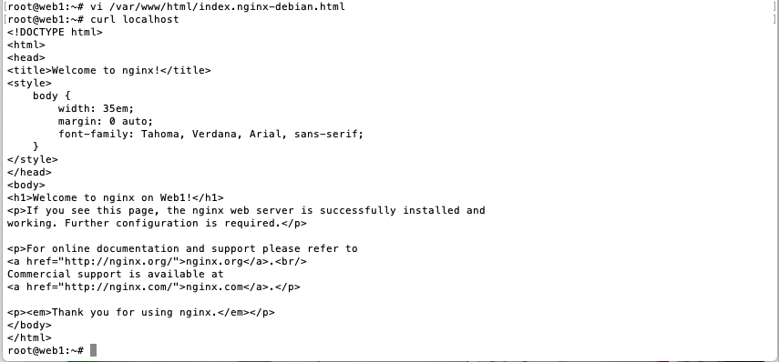  

4. Repeat this process for the remaining web VSIs.

### 4. Configure a VPC Load Balancer  
The IBM Load Balancer for VPC provides the capability to route network traffic across VSIs or applications hosted within your VPC.  It provides proven high availability and ensured performance.  It supports Layer-4 and Layer-7 load balancing across HTTP, HTTPS, and TCP protocols.  It can be configured as a public facing load balaner or a private load balancer.  Many additional advanced features are supported that you can read about [here](https://cloud.ibm.com/docs/vpc?topic=vpc-load-balancers).

1.  From the **VPC Infrastructure** menu, click the **Load balancers** to add a new load balancer to your VPC.  
2.  Click the **New load balancer** link within the Load balancers for VPC page.
3.  Enter a descriptive name for the load balancer (e.g. ``wordpress-loadbalancer``) and ensure the correct VPC is chosen (e.g. ``us-south-dev-vpc``).
4.  Select your desired **Resource group**.
5.  Add desired **Tags**.
6.  Choose the **Region** where you VPC resides.
7.  Choose **Public** as the type of load balancer.
8.  Click the **Subnets** drop-down and choose the 3 ``web`` subnets you previously created. 
	
9.  Click the **New pool** link to configure the **Back-end pool** of services this load balancer will route to.
10.  Name the back-end pool (e.g. ``web-servers``) then enter ``/index.html`` for the **Health check path**.  You can leave the **Defaults** for the rest then click **Save**.  
	- Note: *The Load Balancer can offload HTTPS encryption for you so you can use HTTP between the load balancer and the Nginx web servers.*
11.  Click the **Attach** link to add **Instances** to the **Back-end pool**.
12.  Add the ``web`` subnets and choose the ``web`` VSI in that subnet.  Repeat this for all 3 zones of the MZR, then click the **Attach** button.  
	
13.  Click the **New listener** link to specify the incoming protocol and port that will get routed to the back-end pool.
14.  Select **HTTP** for the Protocol and enter port ``80`` for the port.  
	- Note:  For simplicity, this tutorial just uses HTTP; for any non-trivial scenarios, the author recommends HTTPS as described [here](https://cloud.ibm.com/docs/vpc-on-classic-network?topic=vpc-on-classic-network---using-load-balancers-in-ibm-cloud-vpc).
15.  Ensure ``web-servers`` is selected for the Back-end pool, then click **Save**.
16.  Once everything is entered correctly, click the **Create load balancer** button to provision the load balancer.  
	

### 5. Test the load balancer.
Now you can test connectivity to your private ``web-servers`` thru the load balancer before going further.

1.  Drill into the newly created load balancer and notice the **Heath Status** shows **0/3** and is **Red**.  

	* The health status is failing as port 80 is blocked by the **default-security-group**.
	* Add an **Inbound rule** for TCP port 80 from any source so you can connect to Nginx.  
	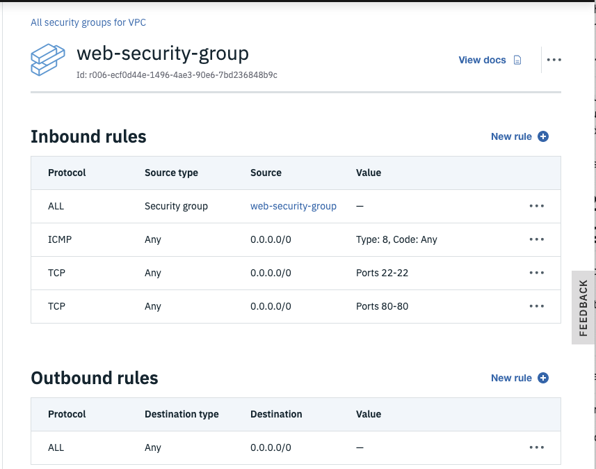

2.  Go back to your load balancer and watch the **Heath Status** go from **Red** to **Yellow** to **Green**.  
	

3.  Click the **Hostname** dotted link to copy the public URL.
4.  Paste this URL into your web browser and notice Nginx is serving up the default index page.  
	
5.  Refresh your browser which is pointing to the load balancer and notice the H1 element indicates each of the web servers are being routed to in a round-robin fashion.


## Congratulations  
  You have successfully created part 1 of this tutorial where you built a software-defined-network using IBM's VPC service.  You also built a custom subnet where you could use your own subnets.  Within those subnets, you provisioned x86 Linux servers and Power9 Linux servers and verified connectivity across the VPC network.  Finally, you created a VPC load balancer in front of Nginx web servers that you verified network traffic was being distributed to.  Now you are ready to install some applications and test out load balancing and high availability across multiple data-centers.


# Part 2 - Install Wordpress in an active-active HA configuration
[Studies](https://www.forbes.com/sites/montymunford/2016/12/22/how-wordpress-ate-the-internet-in-2016-and-the-world-in-2017/) show the popularity of Wordpress which is used by nearly 75 million websites.  The author chose Wordpress as it represents a common multi-tiered web application that is common across many workloads.  While this tutorial demonstrates Wordpress HA, the process is similar with any Web, Mobile, IOT, AI based multi-tiered application.

## Setting up a MariaDB Galera Cluster
As Wordpress depends on a database, we will start bottom-up by installing the database first to simplify dependencies.  We will use MariaDB with Galera as this provides a synchronous multi-master clustered Relational Database.  Read more about Galera [here](https://mariadb.com/kb/en/what-is-mariadb-galera-cluster/).

The IBM Cloud provides additional highly-available databases should you want an enterprise offering that is fully supported:  
* Compose for MySQL - https://cloud.ibm.com/catalog/services/compose-for-mysql
* DB2 pureScale - https://www.ibm.com/developerworks/data/library/dmmag/DBMag_2010_Issue1/DBMag_Issue109_pureScale/index.html
* DB2 on cloud - https://cloud.ibm.com/catalog/services/db2


### 1. Install MariaDB on the Database Servers
1.  Open three terminal shells and connect to each database server (e.g. ``db1``) via ssh.  
	```
	# ssh -J root@<jump_server> root@<db_server>
	ssh -J root@52.116.128.59 root@10.10.11.4
	ssh -J root@52.116.128.59 root@10.10.21.4
	ssh -J root@52.116.128.59 root@10.10.31.4
	```  
	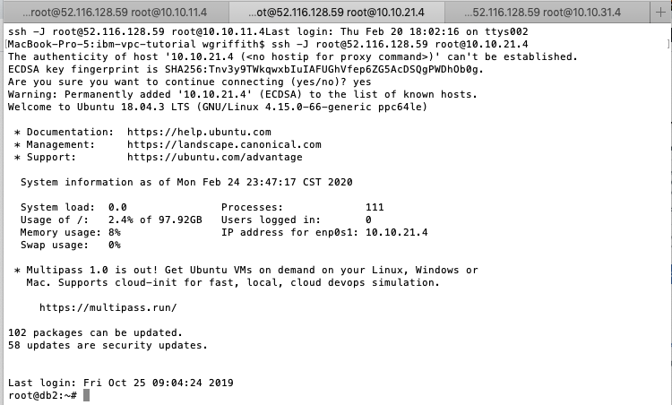
	* Tip:  make sure you included your *public ssh key* when you provisioned the VSI or you'll be prompted for the root login password.

2.  Install the MariaDB 10.3 database on each ``db`` VSI.  
	```
	# MariaDB 10.3 is the default at this time on Ubuntu 18.04
	apt-get -y update
	apt-get -y upgrade
	apt-get -y install mariadb-server mariadb-client galera
	```  

3. Configure Galera settings on each DB server.  
	```
	# Assumes MariaDB 10.3 on Ubuntu 18.04
	vim /etc/mysql/mariadb.conf.d/50-server.cnf
	# Add the following configuration values below [mysqld]
	# Galera Cluster configurations (https://mariadb.com/kb/en/configuring-mariadb-galera-cluster/)
	wsrep_on = ON
	wsrep_provider = /usr/lib/galera/libgalera_smm.so
	# Tip:  use your DB's private IP addresses (or DNS names) here
	wsrep_cluster_address = "gcomm://10.10.11.4,10.10.21.4,10.10.31.4"
	default_storage_engine = InnoDB
	binlog_format = row
	innodb_autoinc_lock_mode = 2
	innodb_force_primary_key = 1
	innodb_doublewrite = 1
	# listen on all IPv4 interfaces
	bind-address           = 0.0.0.0
	```  
	* Tip: Ensure you only have one ``bind-address`` property.

4. Open security group ports for Galera replication.  
	* Open TCP port ``4444`` for any node of the ``db-security-group``.
	* Open TCP ports ``4567-4568`` for any node of the ``db-security-group``.

		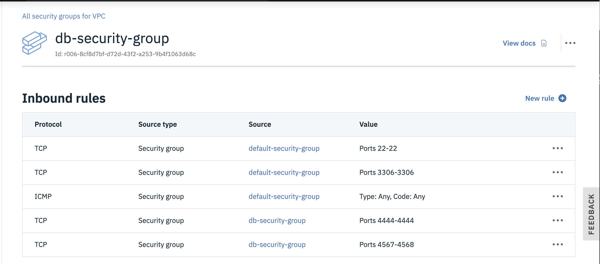

5. Start a new Galera cluster on your primary DB node (e.g. ``db1``).  
	```
	systemctl stop mariadb
	galera_new_cluster

	# login mysql (default password is blank) and check cluster size
	mysql -u root -p

	# run mysql command
	show status like 'wsrep_cluster_size';
	```  
	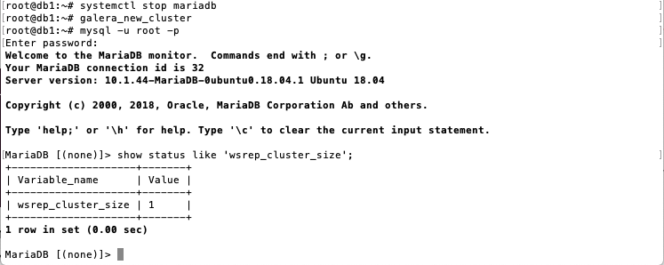

6.  Join Galera cluster on remaining DB nodes.  
	```
	# simply restarting mariadb will join the cluster since the config file tells this node where
	systemctl restart mariadb
	# on any of the nodes, run the mysql command
	show status like 'wsrep_cluster_size';
	```
	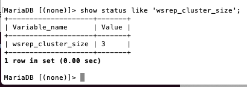

7. Verify Galera cluster is replicating.  
	```
	mysql -u root -p
	create database vpc_test;

	# from a different node
	mysql -u root -p
	show databases;
	```
	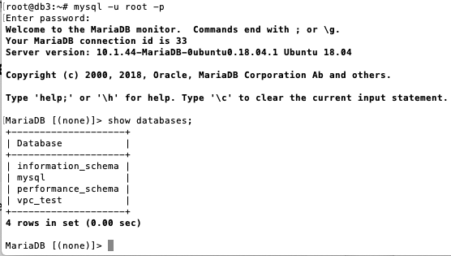
	* Sweet! -  Galera is replicating your database changes to the other cluster nodes.
			

### 2. Configure MariaDB Galera cluster for Wordpress
1.  Enable MariaDB at server boot time on all ``db`` servers.  
	```
	systemctl enable mariadb.service
	```

2.  Update security of MariaDB on all ``db`` servers.  
	```
	mysql_secure_installation
	```
	* root password = ``mariaL0vesVPC``
	* remove anonymous users = ``Y``
	* disallow root login remotely = ``n``
	* remove test database = ``Y``
	* reload priviledge tables now = ``Y``

3.  Create a database for ``Wordpress`` on any of the ``db`` server nodes.  
	```
	mysql -u root -p
	CREATE DATABASE wordpress;
	# TODO:  can we use wp_admin instead of root?
	GRANT ALL ON wordpress.* TO root@'10.10.%.%' IDENTIFIED BY 'mariaL0vesVPC' WITH GRANT OPTION;
	FLUSH PRIVILEGES;
	show databases;
	EXIT;
	```

## Setting up Application Servers for Wordpress
We will use Nginx as the web server with PHP for the application server functionality.  You could use Apache or WebSphere Liberty or any number of Web Servers, but the author has chosen Nginx with PHP to make this tutorial accessible to all.

### 1. Install PHP libraries
You could use the [``user-data`` field](https://cloud.ibm.com/docs/vpc-on-classic-vsi?topic=vpc-on-classic-vsi-user-data) while provisioning the VSIs to do many of these steps during VSI provisioning (you could also burn a [custom image](https://cloud.ibm.com/docs/vpc?topic=vpc-managing-images) from one VSI once it had been installed and configured as desired), but this tutorial walks thru the steps from scratch so you can see what is going on and to make debugging much easier should you run into errors during the process.  

1.  Open three terminals shells and connect to each web server (e.g. ``web1``) via ssh.  
	```
	# ssh -J root@<jump_server> roott@<web_server>
	ssh -J root@52.116.128.59 root@10.10.10.4
	ssh -J root@52.116.128.59 root@10.10.20.4
	ssh -J root@52.116.128.59 root@10.10.30.4
	```
	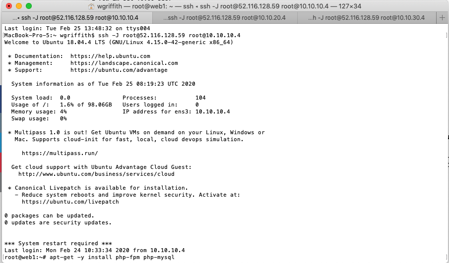

2.  Update PHP libraries on all ``web`` servers.  
	```
	apt-get update -y
	apt-get upgrade -y
	#  keep local version of /etc/ssh/sshd_config
	apt-get -y install php-fpm php-mysql
	#  common libraries needed for wordpress
	apt install -y php-curl php-gd php-intl php-mbstring php-soap php-xml php-xmlrpc php-zip 
	php -v  # to confirm 7.2+ is installed
	# stop php and nginx
	systemctl stop php7.2-fpm  
	systemctl stop nginx
	```

3.  Configure Nginx for PHP on each ``web`` server.  
	* Modify the default Nginx configuration (e.g. ``vi /etc/nginx/sites-available/default``).
		```
		root@web2:~# !vi
		vi /etc/nginx/sites-available/default
	* Add index.php to the list of startup pages.  
		```
		index index.php index.html index.htm index.nginx-debian.html;
		```  
	* Uncomment FastCGI server config and change php to 7.2.  
		```
		location ~ \.php$ {
			include snippets/fastcgi-php.conf;
			fastcgi_pass unix:/run/php/php7.2-fpm.sock;
		}
		```  
	* Uncomment .ht stanza to deny access.  
		```
		location ~ /\.ht {
			deny all;
		}
		```  
		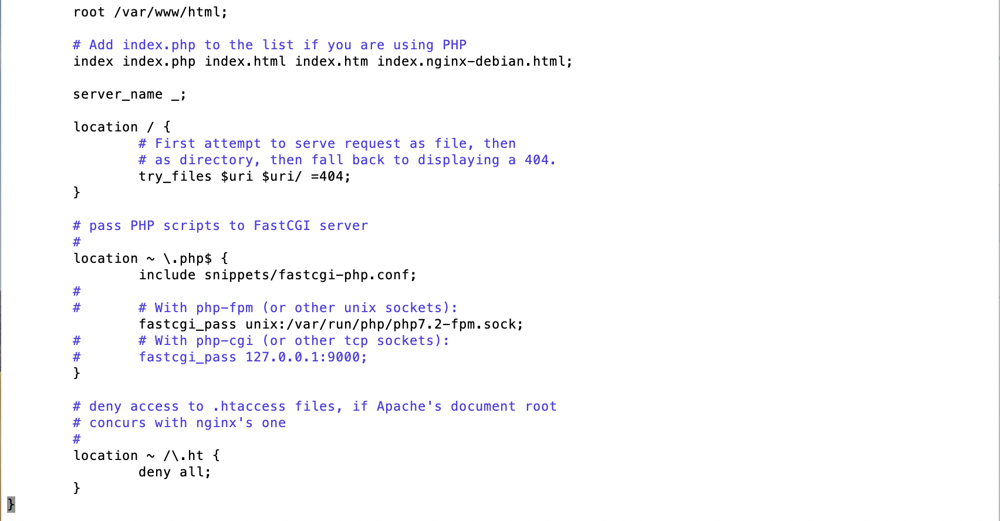  

	* Verify Nginx config.  
		```
		root@web2:~# nginx -t
		nginx: the configuration file /etc/nginx/nginx.conf syntax is ok
		nginx: configuration file /etc/nginx/nginx.conf test is successful
		root@web2:~# 
		```  
	* Ensure nginx and php-fpm are started.  
		```
		systemctl start nginx
		systemctl reload nginx
		systemctl start php7.2-fpm
		```

### 2. Test PHP from Nginx
* Create a php page on each ``web`` server.  
	```
	echo "<?php phpinfo(); ?>" > /var/www/html/info.php
	# test PHP
	curl localhost/info.php | tail -20
	```

### 3. Install GlusterFS
We will use [GlusterFS](https://docs.gluster.org/en/latest/Administrator%20Guide/GlusterFS%20Introduction/) to provide an active-active disk cluster for our Wordpress files so we can tolerate a complete data-center outage without loss of data or availability.

1.  Install glusterFS on each ``web`` server.  
	```
	apt update -y
	apt upgrade -y
	add-apt-repository -y ppa:gluster/glusterfs-7  
	apt install -y glusterfs-server
	```
2.  Mount local disk for glusterFS.  
You first need to create an ``xfs`` filesystem on the disk (i.e. the ``web1-www-vol`` data  volume) that is attached to the ``web`` server.  
	```
	# find your disk
	lsblk
	# block devices output
	NAME   MAJ:MIN RM  SIZE RO TYPE MOUNTPOINT
	vda    252:0    0  100G  0 disk 
	├─vda1 252:1    0  256M  0 part /boot
	└─vda2 252:2    0 99.8G  0 part /
	vdb    252:16   0  100G  0 disk 
	vdc    252:32   0  370K  0 disk 
	vdd    252:48   0   44K  0 disk [SWAP]
	```	
	* Notice the ``vdb`` at 100G is the extra **data volume** (i.e. ``web1-www-vol``) that you created during provisioning the ``web`` VSI.
	
* Format the disk using the ``xfs`` filesystem type.  
	```
	mkfs.xfs /dev/vdb
	```
	* You could partition the disk or use a logical volume manager before adding a filesystem, but we just format the whole drive to make things easy.  

* Mount the disk
	```
	# first mount the block device locally, then you can mount the glusterFS 
	mkdir -p /gluster/wordpress
	echo '/dev/vdb /gluster/wordpress xfs defaults 0 0' >> /etc/fstab
	mount -a
	mkdir -p /gluster/wordpress/brick01
	```  
	* Change brick name to match server number (e.g. brick02 for ``web2``).

* Repeat step 2 on all ``web`` servers.

3. Configure Gluster  
	```
	systemctl enable glusterd
	```

4. Add nodes to trusted storage pool from **one** node only.
	```
	# from web1
	gluster peer probe 10.10.20.4
	gluster peer probe 10.10.30.4
	# verify peer trust
	gluster peer status
	gluster pool list
	```  
	

5. Create Gluster Volume from **one** node only.  
	```
	gluster volume create wordpress-vol replica 3 10.10.10.4:/gluster/wordpress/brick01 10.10.20.4:/gluster/wordpress/brick02 10.10.30.4:/gluster/wordpress/brick03
	# start the volume
	gluster volume start wordpress-vol
	root@web1:~# gluster volume status wordpress-vol
	Status of volume: wordpress-vol
	Gluster process                             TCP Port  RDMA Port  Online  Pid
	------------------------------------------------------------------------------
	Brick 10.10.10.8:/gluster/wordpress/brick01
	/volume                                     49152     0          Y       20032
	Brick 10.10.20.8:/gluster/wordpress/brick02
	/volume                                     49152     0          Y       19315
	Brick 10.10.30.7:/gluster/wordpress/brick03
	/volume                                     49152     0          Y       19023
	Self-heal Daemon on localhost               N/A       N/A        Y       20053
	Self-heal Daemon on 10.10.20.8              N/A       N/A        Y       19336
	Self-heal Daemon on 10.10.30.7              N/A       N/A        Y       19044
	
	Task Status of Volume wordpress-vol
	------------------------------------------------------------------------------
	There are no active volume tasks
	```
	* Ensure you have an **Inbound** security group rule to allow **all** traffic (or TCP port 49152 for Gluster) among VSIs of the same security group.  
	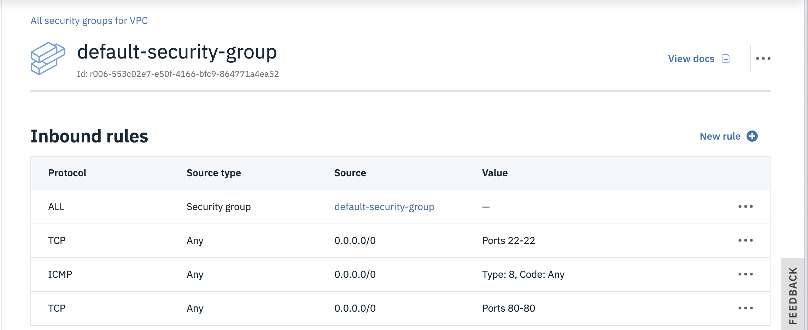

* Only allow ``web`` nodes to mount the Gluster volume.   
	```
	# run from one node only
	gluster volume set wordpress-vol auth.allow 10.10.10.4,10.10.20.4,10.10.30.4
	```

6. Mount the GlusterFS volume locally on **each** ``web`` server.
	```
	# stop nginx
	systemctl stop nginx
	mv /var/www/html{,.orig}
	mkdir /var/www/html
	echo 'localhost:/wordpress-vol /var/www/html glusterfs defaults,_netdev 0 0' >> /etc/fstab
	mount -a
	df -h
	```
	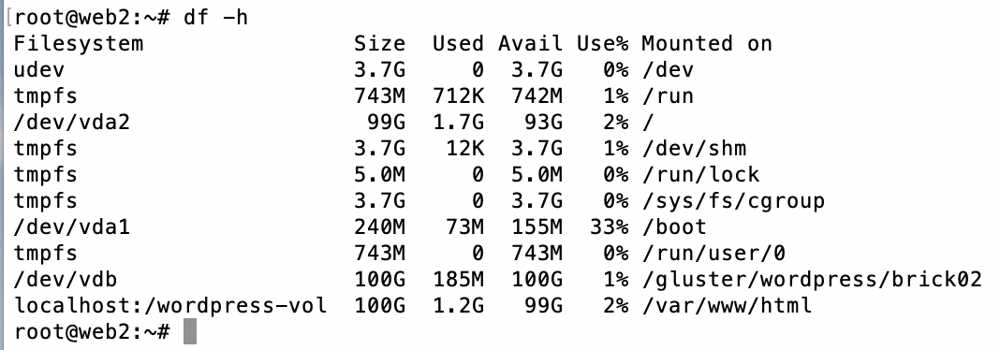

7. Test Gluster replication from one ``web`` server node.  
	```
	echo 'Hello Gluster!' > /var/www/html/index.html
	systemctl start nginx
	curl localhost
	```

8. Start Nginx on the rest of the ``web`` server nodes.
	```
	systemctl start nginx
	curl localhost
	```

### 4. Install Wordpress  
Since GlusterFS will replicate ``/var/www/html`` to all of the ``web`` servers, you only need to install Wordpress on one node.
1.  Download and install Wordpress on one of the ``web`` servers.  
	```
	cd /tmp && wget https://wordpress.org/latest.tar.gz
	tar -xvf /tmp/latest.tar.gz 
	# put wordpress in html to make things easy 
	cp -r /tmp/wordpress/* /var/www/html/
	rm -rf /tmp/wordpress
	rm -rf /tmp/latest.tar.gz
	chown -R www-data:www-data /var/www/html/wp-content
	chmod -R 755 /var/www/html/wp-content
	mv /var/www/html/wp-config-sample.php /var/www/html/wp-config.php
	```

2.  Update ``/etc/hosts`` with the database IP address on **each** ``web`` node.
	* Use the same database name (e.g. ``mariadb``) on all ``web`` servers, but change the **IP Address** to the corresponding ``db`` server in the same **zone**.  

		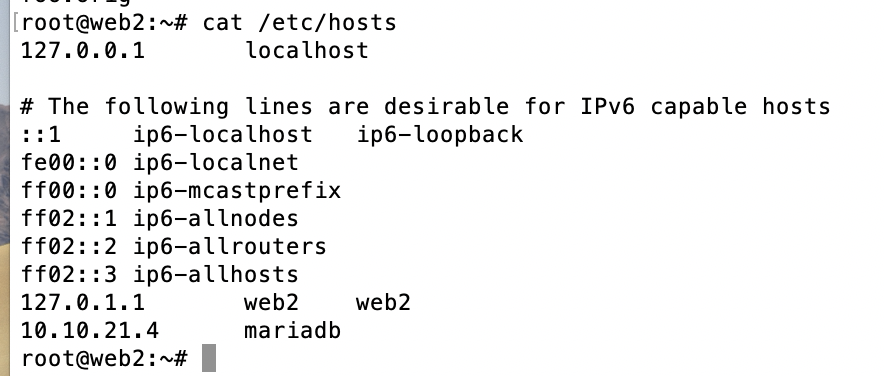

3. Configure Wordpress on **one** node only to point to db servers.  
	* Get wordpress secret-keys using ``# curl  https://api.wordpress.org/secret-key/1.1/salt/``
	* Copy them into wp-config.php
	* Edit ``/var/www/html/wp-config.php`` and set the DB parameters
	```
	define('DB_NAME', 'wordpress');
	define('DB_USER', 'root');  # TODO:  can I use db_admin
	define('DB_PASSWORD', 'mariaL0vesVPC');
	define('DB_HOST', 'mariadb'); # use private load balancer
	```
	

4.  Start nginx on **each** ``web`` server.
	```
	systemctl start nginx
	systemctl reload nginx
	systemctl start php7.2-fpm
	```

5. Verify Wordpress
	*  Open the ``web-load-balancer`` hostname (e.g. ``956071b2-us-south.lb.appdomain.cloud``) in your web browser.  

6. Setup Wordpress
  * Enter ``Wordpress on IBM VPC`` for the **Site Title**.
  * Enter ``<an admin userID>`` for the **Username** field.
  * Enter a strong ``password``.
  * Enter your ``admin's email address``.
  * Click to ``Discourage search engines...``.
  * Click **Install WordPress**.
  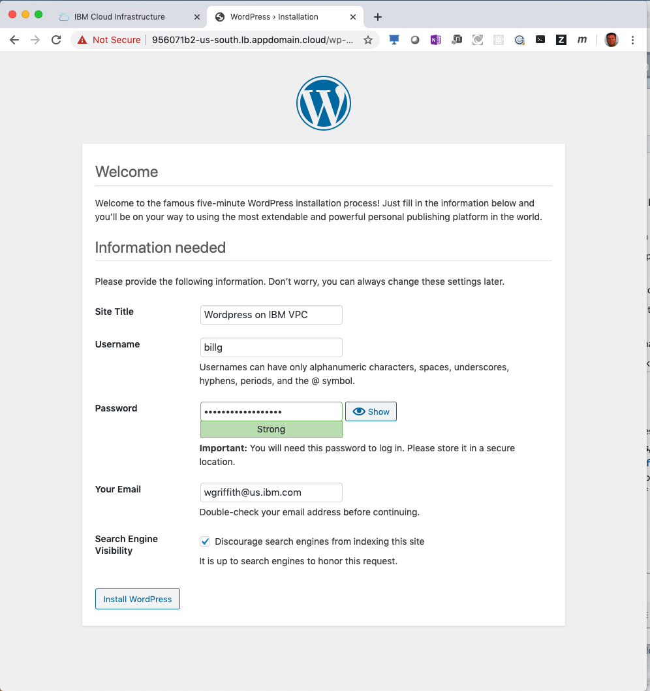

7.  Add a Wordpress Post
  * Login to Wordpress
  * Click **Posts** link, then click **Add New** button.
  * Add your post.
    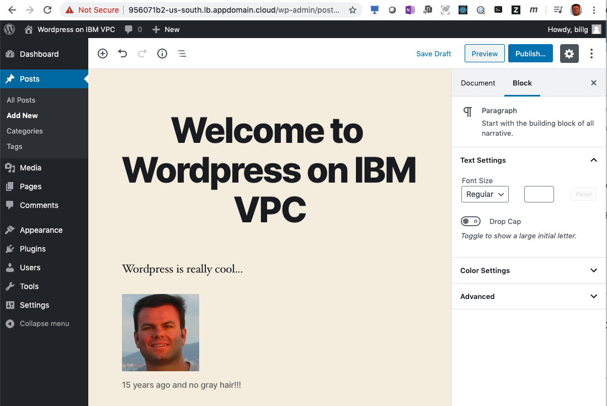
  * Publish your post.

8.  Verify Wordpress High Availability
  * From ``web1`` do a find command to verify your image was uploaded in your post.
  ```
    find /var/www/html/wp-content/uploads/
    /var/www/html/wp-content/uploads/
    /var/www/html/wp-content/uploads/2020
    /var/www/html/wp-content/uploads/2020/03
    /var/www/html/wp-content/uploads/2020/03/billface-1.png
  ```
  * Repeat the ``find`` command from another ``web`` node and you'll see the image is there also.

## Failover Testing
Now that you have a highly available 3 zone web application, you can now test various failures and ensure your web application continues to process user requests.


### 1.  Test DB failure
Shutdown one of the ``db`` nodes and verify Wordpress continues to work.  
  * Click the **Virtual server instances** link in the **VPC Infrastructure** section of the IBM Cloud console.  
  * Click **ellipsis** next to ``db1`` and choose **Stop**.  
    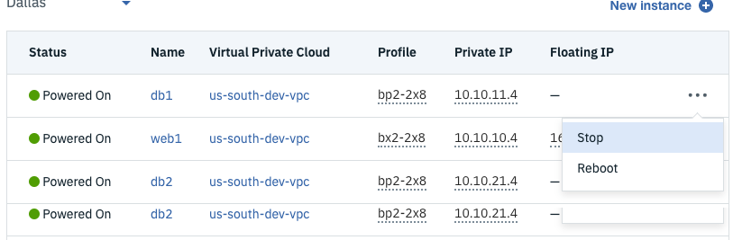
  * Refresh Wordpress URL (i.e. Load Balancer hostname) a few times to cycle thru to the failing DB.
    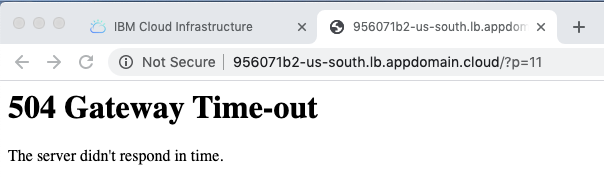
      * Notice you get an outage, even though you have 2 other DBs.  You need to tell the **Load Balancer** to not route traffic to a ``web`` server IF the ``db`` for that zone is down.
  * Edit the ``web-servers`` **Back-end pool** in your ``wordpress-load-balancer`` and change the **Health check** value from ``/index.html`` to ``/index.php``.
    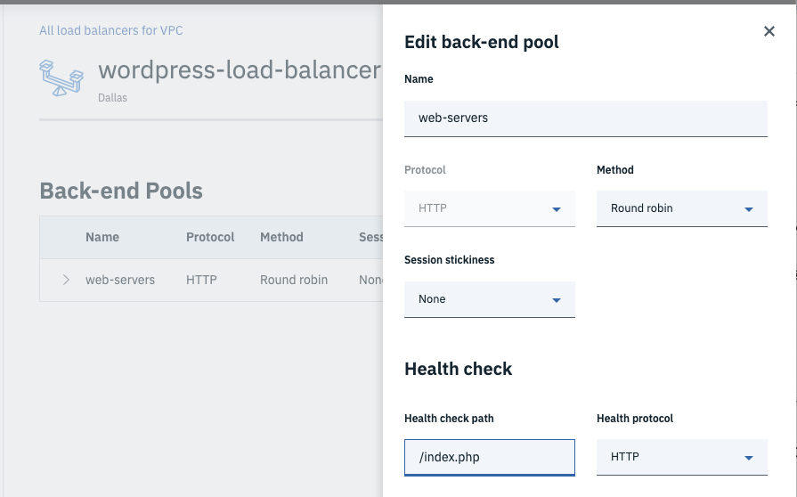
      * Now the Load Balancer will know not to route traffic to the failing ``web`` server if Nginx is down or if the database is down.
  * Try refreshing your browser a few times and notice that the 504 Gateway Time-out error doesn't reappear.
  * Restart the ``db`` node that you stopped earlier.
	

### 2.  Test Web failure
Shutdown one of the ``web`` nodes and verify Wordpress continues to work.
  * Stop a ``web`` node if a different zone than the zone from your ``db`` test. 
  * Refresh your browser and notice you don't see any errors; yet if you check the ``wordpress-load-balancer``, you'll notice only 2/3 web-servers are up.
    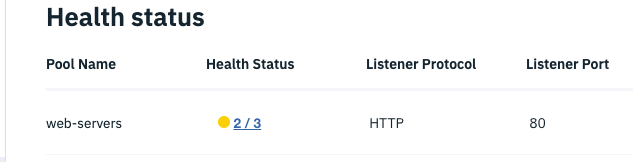
  * Edit your previous post and upload a new image.
  * Examine the filesystem of each ``web`` node and verify uploads are still working after the *db* failure and the *web* failure.

	```
	root@web3:~# find /var/www/html/wp-content/uploads/
	/var/www/html/wp-content/uploads/
	/var/www/html/wp-content/uploads/2020
	/var/www/html/wp-content/uploads/2020/03
	/var/www/html/wp-content/uploads/2020/03/billface-1.png
	/var/www/html/wp-content/uploads/2020/03/wordpress_healthcheck.png
	/var/www/html/wp-content/uploads/2020/03/wordpress_healthcheck-300x187.png
	/var/www/html/wp-content/uploads/2020/03/wordpress_healthcheck-150x150.png
	/var/www/html/wp-content/uploads/2020/03/wordpress_healthcheck-768x479.png
	```
	* Examine the **db** server to verify your update is persisting.

	```
	root@db3:~# mysql -u root -p
	MariaDB [(none)]> show databases;
	MariaDB [(none)]> use wordpress;
	MariaDB [wordpress]> show tables;
	MariaDB [wordpress]> select * from wp_posts;
	```


### 5.  Cleaning up everything
You have to remove things in order of dependency.  You can of course do this from command line so you could have a deleteVPC script, but for the sake of completeness, we'll use the IBM Cloud UI.  

  1.  Release any **Floating IP addresses** from your VSIs.
  2.  Stop all **VSIs** of your VPC.
  3.  Delete all **VSIs** from your VPC.
  4.  Delete all **Load Balancers** from your VPC.
  5.  Delete all **subnets** from your VPC.
  6.  Verify all **Block storage volumes** are deleted from your VPC.
  7.  Finally, delete your custom **VPC**.


## Congratulations
This has been a long tutorial, but our hope is that you have a better understanding of the IBM Public Cloud and how you can configure highly available multi-tiered applications within a secure Virtual Private Cloud (VPC) to serve your transformational objectives.

We look forward to your workloads joining the IBM Cloud family.   :)

##  Disclaimer:
The postings on this site are my own and don't necessarily represent IBM's positions, strategies or opinions.

