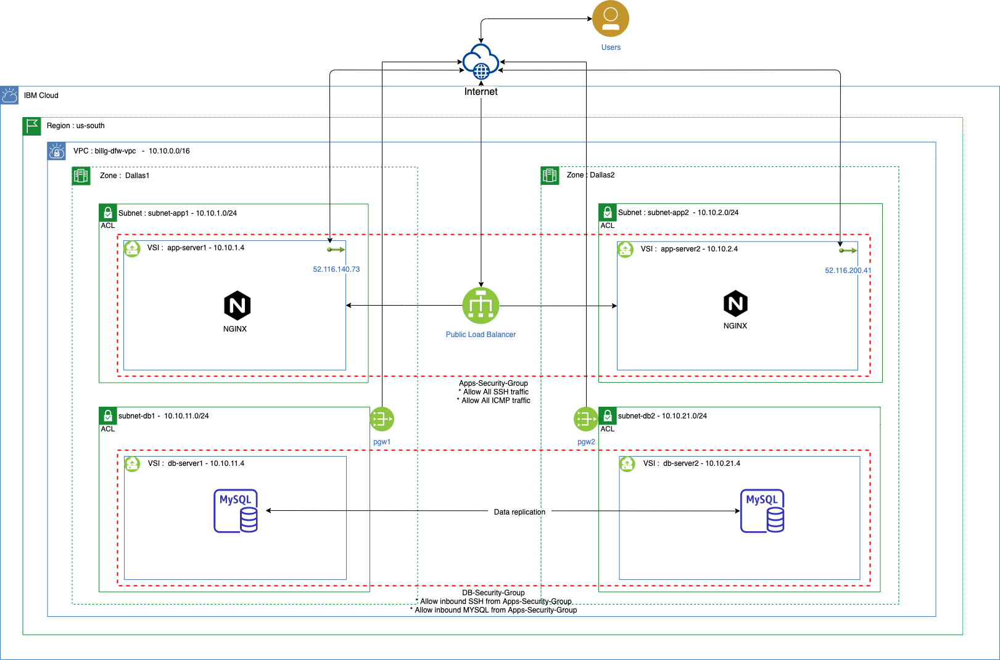
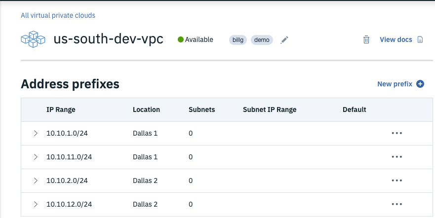
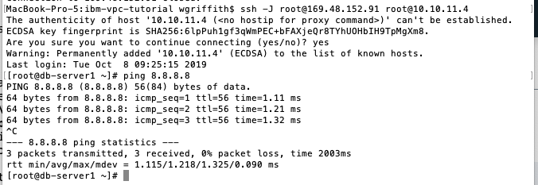

---
copyright:
  years: 2020
lastupdated: "2020-02-20"
lasttested: "2020-02-20"
---

# Creating a multizone highly available application using IBM Virtual Private Cloud

This tutorial will walk thru creating a custom Virtual Private Cloud (VPC) within IBM Public Cloud.  

## Architecture

TODO:  describe diagram with numbers and why

## Outline

1. Configure a Virtual Private Cloud ([VPC](https://cloud.ibm.com/docs/vpc-on-classic?topic=vpc-on-classic-about)).
2. Create Virtual Server Instances (VSI).
3. Install web-app workload.
4. Configure High Availability and horizontal scalability.
5. Test application resilency.

## Software Defined Networking with a Virtual Private Cloud

In this section, you will create a custom VPC in a multi-zone-region (MZR) so you can provide high availability across multiple data-centers.

### 1. Create a private virtual cloud (VPC)
1.  Login to the IBM Cloud and click the **hamburger stack** then select **VPC Infrastructure** ([VPC](http://cloud.ibm.com/vpc-ext/overview)) followed by **Create VPC for Gen 2**. 

2.  Fill in values for the **New virtual private cloud** wizard:  
	* Enter a name for your new VPC (e.g. ``us-south-dev-vpc``).
	* Choose a **Resource group**.
	* Add **tags** to organize your team, project, function, etc.
	* Select the **region** for the VPC. *VPCs are tied to regions.*
	* Leave **Allow SSH** and **Allow ping** for now -- *you can remove these rules once you get connectivity working.*
	* Uncheck **Create a default prefix for each zone** since you will create your own subnet.
	* Click the **Create virtual private cloud** button.

		

### 2.  Configure VPC defaults.  
1. Drill into your newly created VPC.
	* Click the **Default ACL** link if you wish to change the name to something more descriptive (e.g. defaultNACL).
	* Click the **Default Security Group** link to change the name.
2. Click the **Manage address prefixes** link followed by the **New prefix** link.

3. Add IP range CIDR block addresses per the Architecture diagram.
	* Note: Using a subnet naming convention makes it easier to remember the IP addresses.  For example, using 10.10.1.0 for Dallas1 and then 10.10.2.0 for Dallas2.  Also notice skipping 10 for the subnet prefixes to be used by the DB tier with a 10.10.11.0 for Dallas1 and a 10.10.12.0 for Dallas2.  Use what works for you, but consistency and a standard makes it easier with communicating to the team.

4. Click the **Overview** breadcrumb link to return to the main VPC page.

### 3.  Create subnets for your VPC.  
TODO: blurb about subnets  

1. Click the **New subnet** button to launch the Subnet wizard.
2. Change your data-center to match the data-center you used for your addresss prefixes. (e.g. Dallas1)
3. Enter a name for the web-tier subnet such as the architecture diagram depicts. (e.g. subnet-app1)
4. Add the subnet to your resource group to make management of your IBM Cloud services easier.
5. Select the **Address prefix** that matches the Architecture diagram. (e.g. subnet-app1 uses 10.10.1.0/24)
6. Select **Attached** for the Public gateway if you want the virtual servers to have connectivity to the Internet (e.g. to get OS patches).  *You can add this later if you desire.*
7. Click the **Create subnet** button.
8. Repeat this section for the 4 subnets in the Architecture diagram.
9. Click the **VPC Layout** link and select your VPC in the drop-down.  Click each subnet box and examine the subnet names, IP address ranges, data-center location, and public Gateway IP address.
	
	* Tip:  you may need to resize your browser window to get the subnets to stack in a more readable fashion.

### 4.  Create security groups for the Database tier.  
Tip: *you may also wish to rename the default security group and set the rules*.  
TODO:  blurb about security groups.  

1.  From the left-side **VPC Menu**, select the **Security groups** menu item and click the **new security group** link.
2.  Enter a name for the security group (e.g. ``db-security-group``).
3.  Ensure the correct VPC is selected as well as the desired Resource group, then click the **New rule** link for the **Inbound rules** section.
4.  Choose **TCP** as the Protocol, then select the **Port range** radio button and enter **22** for both the Port min and the Port max (*port 22 is to allow SSH connections*) and click the **Save** button.
5.  Click the **Security group** radio button for the Source type and choose your default security group.
	* Tip:  this rule means that VSIs protected by this security group will allow SSH connections from other VSIs that are protected by the default security group.
6.  Click the Inbound **New rule** link again and enter **3306** (*MYSQL Database port*) for Port min and Port max and again select your default security group as the Source type.
7.  Add another Inbound rule for **ICMP** (*so you can ping the VSIs*) from any Source source (*You can harden things up once you have everything connected together.*).
8.  Click the Outbound **New rule** link and choose **All** Protocols from **Any** Destination type to permit all outbound traffic from VSIs protected by this security group.
9.  Once the rules are correct, click the **Create security group** button.

 
## Virtual Server Instances  
TODO: blurb about VSIs -- IBM plugs

### 1. Create VSI for each subnet
1.  Select the **VPC layout** menu item of the VPC left-side menu and choose your VPC.
2.  Select each subnet of the VPC and resize the window so you can see the subnets stacked.
3.  Click the ellipsis in the corner of each subnet and choose **New instance**.
4.  Fill in the details for the **New virtual server for VPC** wizard.
	*  Enter a name (e.g. **app-server1**).
	*  Ensure the correct VPC is selected.
	*  Choose your desired resource group.
	*  Add any desired Tags.
	*  Choose the data-center that matches the diagram (e.g. **Dallas1**).
	*  For the web-tier, choose x86 as the chipset.  For the data-tier, choose POWER.
	*  Choose **CentOS** for the Operating System Image.
	*  Choose the **2 vCPUs by 8GB RAM** Balanced profile. 
	*  Click **New key** if your SSH key hasn't been added already; otherwise, just select your existing SSH key.
		* Fill in the **Add SSH Key** Wizard if needed.
	*  Leave the Boot volume and Data volume defaults as is, but click the Pencil icon for the **eth0** network interfaces and ensure the correct Subnet is selected (e.g. **subnet-app1** for app-server1 in the first data-center and **subnet-app2** for app-server2 in the second data-center of your VPC.)
	*  Ensure the correct Security group is checked (*See the Architecture diagram if unclear.*).
	*  Click the **Create virtual server instance** button.

	* Note:  the VSI provision very rapidly (*usually in under 1 minute*).
5.  Repeat step 4 for each VSI in the architecture diagram (i.e. app-server1, app-server2, db-server1, db-server2).

6.  Click the **Reserve** link for a new **Floating IP** for the **app-server1** instance so you can SSH into the VSI.
	* TIP:  VSIs don't have public IP addresses by default which is more secure; however, getting to the VSI without a public IP requires VPN or a jump server or Direct Link, etc. which is beyond the scope of this tutorial.  For a production setup, the author recommends a much more hardened security architecture.

### 2.  Test connectivity across the VPC

1.  Copy the **Floating IP** from the **app-server1** that you just created and pull up a command-line terminal program (e.g. *Terminal* in MacOS or *Putty* in Windows).
2.  Connect to the VSI using ssh login (e.g. ``# ssh root@169.48.152.91``).

3.  Ping each VSI's private IP in the VPC.
  
	* Notice you can ping all private IP addresses (i.e. 10.10.x.4) out-of-the-box without setting up any explicit routes.  IBM's VPC uses an implicit router to route traffic across your VPC.
4.  Exit out of **app-server1** and SSH into **db-server1** using **app-server1** as a *jump server* (e.g. ``ssh -J <user>@<jump-server> <user>@<target-server>``).  

	* Notice that the DB server doesn't have public IP address, so you jumped thru the *Floating IP* of the app-server1 and then into the *private IP* address of the DB server.
5.  Ping Google's DNS address 8.8.8.8 to verify that you have outbound connectivity thru the *Public Gateway* that you attatched to your subnet.  

6.  Do a ``yum update`` to verify that you can update the DB VSI.
7.  Run ``lscpu`` to examine the CPU details of the DB-server1.

	* Notice that the database server is a POWER8 CPU running the CentOS operating system.
8.  Repeat the ``yum update`` for each VSI using **app-server1** as the jump server.

Congratulations!!!  You have successfully create a software-defined-networking using IBM's VPC service where you brought your own custom subnets.  Within those subnets, you provisioned x86 Linux servers and Power8 Linux servers and verified connectivity across the VPC network.  Now you are ready to install some applications and test out load balancing and high availability across multiple data-centers.

## Install Application Software on VSIs

### 1. Install NGINX on the app servers

### 2. Install MySQL on the db servers

### 3. Install Wordpress on the app servers

### 4. Configure Wordpress to point to db servers

### 5. Test application configuration

## Configure High Availability

### 1. Provision a cross-zone Load Balancer

### 2. Configure health-checks

### 3. Test data-center failure

### 4. Configure database replication

### 5. Test DB failover

