# Create a custom IBM Virtual Private Cloud (VPC) across 3 zones for high availability

IBM Cloud™ comprises over 60 [data centers](https://www.ibm.com/cloud/data-centers/) around the world.  Additionally, IBM Cloud includes 6 multi-zone regions ([MZR](https://cloud.ibm.com/docs/infrastructure/loadbalancer-service?topic=loadbalancer-service-multi-zone-region-mzr-overview)) where at least 3 geographically dispersed and independent data-centers can be clustered together over a very high-speed, low-latency network to provides the infrastructure for highly available applications.  Within these MZRs, you can create your own Virtual Private Cloud ([VPC](https://cloud.ibm.com/docs/vpc-on-classic?topic=vpc-on-classic-about)), which  provide a software define network within the IBM public cloud.  VPC gives you the security of a private cloud, with the agility and ease of use as a public cloud.

This tutorial will walk thru creating a custom Virtual Private Cloud (VPC) within an MZR of the IBM Public Cloud.  We will cover the following topics:
1.  Create a custom VPC from scratch.
2.  Creating custom subnets with BYOIP (Bring your own IP).
3.  Creating custom security groups to firewall subnet traffic.
4.  Creating custom Virtual Server Instances (VSI) within this VPC.
5.  Creating a custom load balancer across the VSIs.
6.  Verifying high availability and scalability of the VSIs within the MZR.

## Architecture
The following diagram depicts the topology of what you will build in this tutorial.  You'll note the topology includes multiple zones which include multiple subnets, which are isolated by zones and logical tiering with security groups to protect what traffic is allowed into and out of the VSIs within these subnets.  While this tutorial focuses on a single MZR, which provides a great deal of resilency from any single point of failure (SPOF), it does not address a complete city outage such as a natural disaster.  For Disaster Recovery scenarios, it is recommended to deploy your application across two or more MZRs as described in this [article](https://cloud.ibm.com/docs/tutorials?topic=solution-tutorials-strategies-for-resilient-applications).

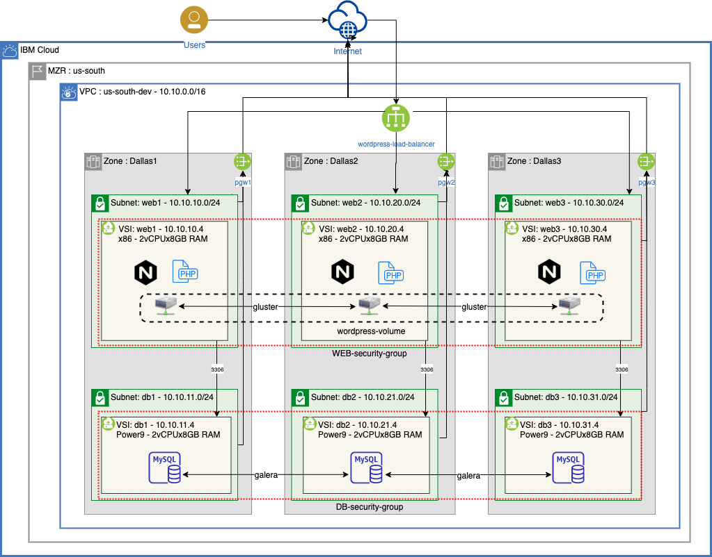
* 3X redundancy is needed to achieve [99.999% availability](https://www.ibm.com/garage/method/practices/run/cloud-platform-for-ha) (i.e. <5m per year).
* IBM zones within an MZR are isolated from other zones and provide complete redundancy from other zones within an MZR (i.e. there is no single-point-of-failure across zones)
* 3 nodes is often recommended for many clustering services (e.g. MariaDB Galera, VMWare, Kubernetes, etc.)

## Software Defined Networking with a Virtual Private Cloud
IBM Cloud™ Virtual Private Cloud (VPC) is a virtual network within your Cloud account. It provides fine-grained security, multi-tenant isolation, and network traffic segmentation.  Each VPC is deployed to a single region; however a VPC can span multiple zones (i.e. Data-centers).  For example, in an MZR with 3 data-centers, your VPC can span all 3 data-centers providing a logical network that sits on top of multiple physical networks across these data-centers.  This allows you to recreate your own premise network (e.g. 10.10.x.x or 192.168.x.x) without conflicting with other tenants that use these same IP addresses within their custom VPC.  This makes migrating to IBM Cloud easier and reduces risk associated with changing your application's underlying network.  


### 1. Create a private virtual cloud (VPC)
The IBM Cloud is constantly adding new features and services, which is why you will see multiple VSI options:  
- Classic Virtual Server Instances (VSI) where you'll find VLAN segregated servers, bare metal servers, VMWare servers, SAP servers, etc.
- Generation 1 VPC VSIs
- Generation 2 VPC VSIs

This tutorial will use Gen2 VPC VSIs.

1.  Login to the IBM Cloud and click the **hamburger stack**, then select **VPC Infrastructure** ([VPC](http://cloud.ibm.com/vpc-ext/overview)) followed by **Create VPC for Gen 2**. 

2.  Fill in values for the **New virtual private cloud** wizard:  
	* Enter a name for your new VPC (e.g. ``us-south-dev-vpc``).
	* Choose a **Resource group**.
	* Add **tags** to organize your team, project, function, etc.
	* Select the **region** for the VPC.  *VPCs are tied to regions.*
	* Leave **Allow SSH** and **Allow ping** for now -- *you can remove these rules once you get connectivity working.*
	* Uncheck **Create a default prefix for each zone** since you will create your own subnet.
	* Click the **Create virtual private cloud** button.

		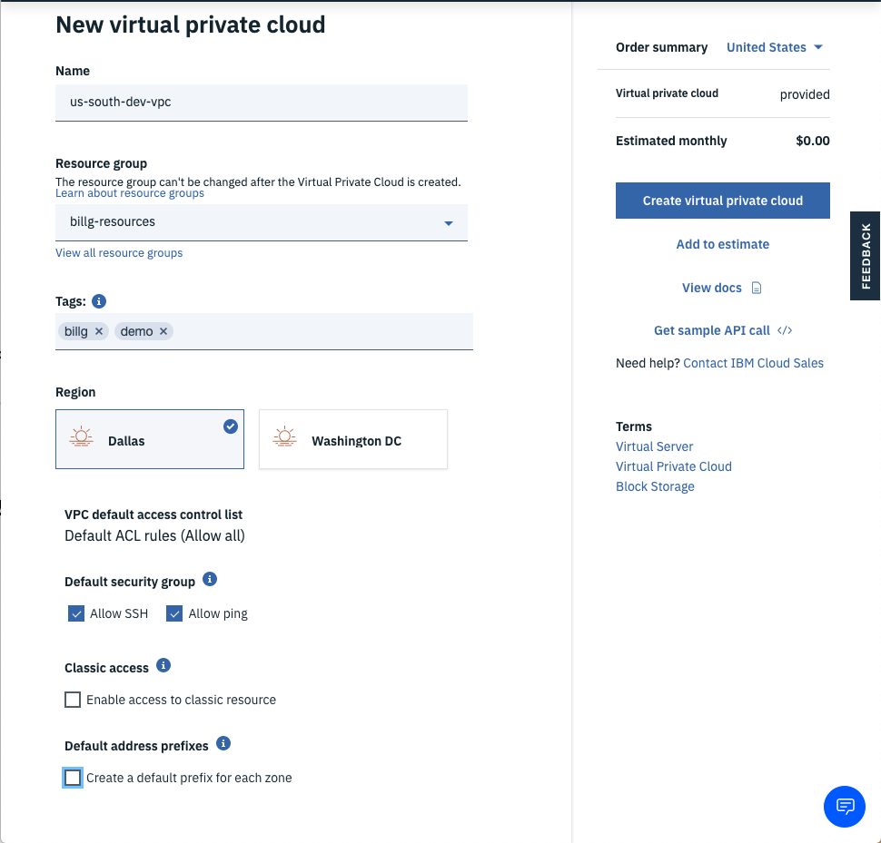

### 2.  Configure VPC defaults.  
The VPC defaults are designed for simplicity in getting started and may require modification for a production environment where security is paramount.  

1. Drill into your newly created VPC.
	* Click the **Default ACL** link if you wish to change the name to something more descriptive (e.g. ``defaultNACL``).
	* Click the **Default Security Group** link to change the name.
2. Click the **Manage address prefixes** link followed by the **New prefix** link.
3. Add IP range CIDR block addresses per the Architecture diagram.
	* Note: Using a subnet naming convention makes it easier to remember the IP addresses.  For example, using 10.10.10.0 for Dallas1 and then 10.10.20.0 for Dallas2. Use what works for you, but consistency and a standard makes it easier with communicating to the team.
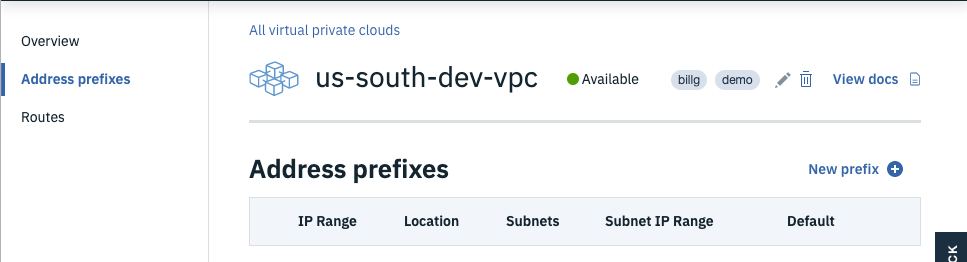
4. Click the **Overview** breadcrumb link to return to the main VPC page.

### 3.  Create subnets for your VPC.  
Isolating VSIs to separate subnets allows easier firewalling and protection (e.g. only allow DB connections to the DB subnet and only from the web-tier subnet).  Also, note that subnets can't span zones.

1. Click the **New subnet** button to launch the Subnet wizard.
2. Change your data-center to match the data-center you used for your addresss prefixes. (e.g. ``Dallas1``)
3. Enter a name for the web-tier subnet such as the architecture diagram depicts. (e.g. ``web1``)
4. Add the subnet to your resource group to make management of your IBM Cloud services easier.
5. Select the **Address prefix** that matches the Architecture diagram. (e.g. ``web1`` uses ``10.10.10.0/24``)
6. Select **Attached** for the Public gateway if you want the virtual servers to have outbound connectivity to the Internet (e.g. to get OS patches).  
7. Click the **Create subnet** button.
8. Repeat this section for the 5 other subnets in the Architecture diagram.
9. Click the **VPC Layout** link and select your VPC in the drop-down.  
10. Click each subnet box and examine the subnet names, IP address ranges, data-center location, and public Gateway IP address.
	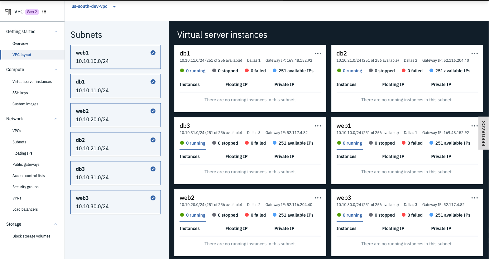
	* Notice how the subnets within a zone use the same Public Gateway.

### 4.  Create security groups for the Database tier.  
Network Interface Cards (NICs) within VSIs are attached to security groups and allow you to filter what traffic is allowed into the VSI.  By default, all traffic is blocked, so you'll need to open up specific ports depending on what services within the VSI you wish to expose to other computers.  A really helpful feature is the ability to allow VSIs that are attached to other security groups to connect (e.g.  only allow the web-tier VSIs to connect to the db-tier VSIs.)  You can read more about security groups [here](https://cloud.ibm.com/docs/vpc?topic=vpc-using-security-groups).

1.  From the left-side **VPC Menu**, select the **Security groups** menu item and click the **new security group** link so you can add a different security group for the database tier. *You can just use the default security group for the web tier.*
2.  Enter a name for the security group (e.g. ``db-security-group``).
3.  Ensure the correct VPC is selected as well as the desired Resource group, then click the **New rule** link for the **Inbound rules** section.
4.  Choose **TCP** as the Protocol, then select the **Port range** radio button and enter ``22`` for both the Port min and the Port max (*port 22 is to allow SSH connections*).
5.  Next, select the **Security group** radio button for the Source type of the rule and choose your default security group, then click the **Save** button.
	* Tip:  this rule means that VSIs protected by this security group will allow SSH connections from other VSIs that are protected by the default security group. (i.e. only allow SSH to the DBs from the web VSIs.)
6.  Click the Inbound **New rule** link again and enter ``3306`` (*MYSQL Database port*) for Port min and Port max and again select your default security group as the Source type.
7.  Add another Inbound rule for **ICMP** (*so you can ping the VSIs*) traffic from any VSI that is attached to the default security group and click **Save**. 
8.  Click the Outbound **New rule** link and choose **All** Protocols from **Any** Destination type to permit all outbound traffic from VSIs protected by this security group.
9.  Once the rules are correct, click the **Create security group** button.
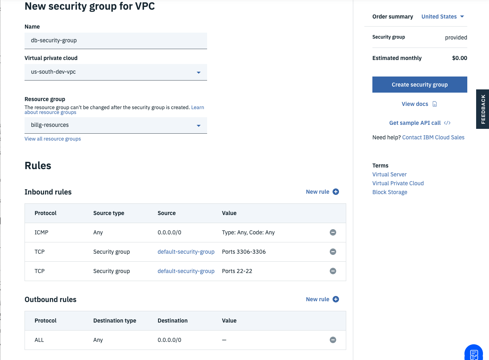

 
## Virtual Server Instances  
Now that you have a VPC created, you can provision Gen2 VSIs within your custom network.  These new VSIs provision rapidly (usually in seconds) and have very high-speed networking (e.g. 100Gbps).  Additionally, IBM Power hardware is available in Beta, which is particularly good at multi-threaded applications as the CPU includes 2X the threads per core as x86 CPUs, making it more cost effective for multi-threaded applications like DBs, AI jobs, Apache Spark, etc.  You can read more [here](https://cloud.ibm.com/docs/vpc?topic=vpc-about-advanced-virtual-servers).

### 1. Create VSI for each subnet
1.  Select the **VPC layout** menu item of the VPC left-side menu and choose your VPC.
2.  Select each subnet of the VPC and resize the window so you can see the subnets stacked.
3.  Click the **ellipsis** in the corner of each subnet and choose **New instance**.
4.  Fill in the details for the **New virtual server for VPC** wizard.
	*  Enter a name (e.g. ``db1``).
	*  Ensure the correct VPC is selected.
	*  Choose your desired resource group.
	*  Add any desired **Tags**.
	*  Choose the data-center that matches the diagram (e.g. ``Dallas1``).
	*  For the web-tier, choose **x86** as the chipset.  For the data-tier, choose **POWER**.
	*  Choose **Ubuntu 18.04** for the Operating System Image.
	*  Choose the **2 vCPUs by 8GB RAM** Balanced profile. 
	*  Click **New key** if your SSH key hasn't been added already; otherwise, just select your existing SSH key.
		* Fill in the **Add SSH Key** Wizard if needed.
	*  Leave the Boot volume and Data volume defaults as is, but click the Pencil icon for the ``eth0`` network interfaces and ensure the correct Subnet is selected (e.g. ``app1`` for web1 in the first data-center and ``web2`` for web2 in the second data-center of your VPC.)
	*  Ensure the correct **Security group** is checked (*See the Architecture diagram if unclear.*).
	*  Click the **Create virtual server instance** button.
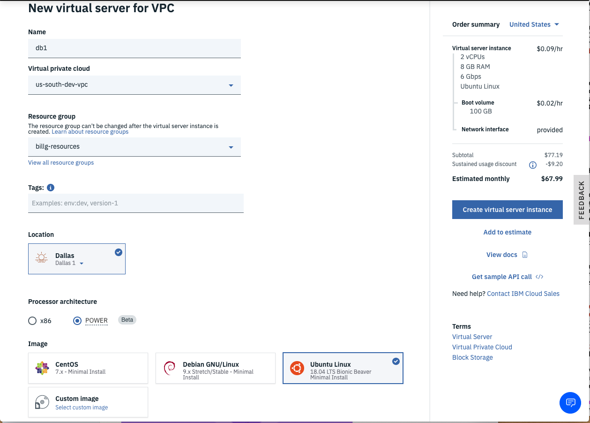
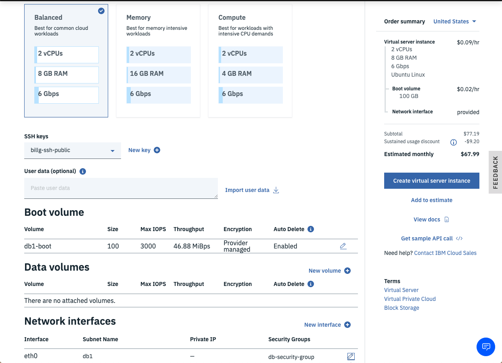
	* Note:  the VSI provision very rapidly (*usually in under 1 minute*).
	* Also note the POWER VSIs are cheaper than x86 since the HW is more performant.
5.  Repeat step 4 for each VSI in the architecture diagram (i.e. ``web1..web3``, ``db1..db3``).
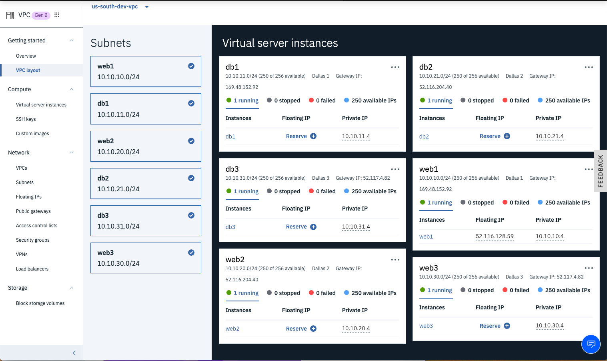
6.  Click the **Reserve** link for a new **Floating IP** for the **web1** instance so you can SSH into the VSI.
	* TIP:  VSIs don't have public IP addresses by default which is more secure; however, getting to the VSI without a public IP requires VPN or a jump server or Direct Link, etc. which is beyond the scope of this tutorial.  For a production setup, the author recommends a much more hardened security architecture.
	* We'll use ``web1`` as the jumpserver to the other VSIs.

### 2.  Test connectivity across the VPC
Now that you have VSIs provisioned within isolated subnets within your VPC, you will remotely login to one of your VSIs that has a floating public IP address and then test connectivity to all of the other VSIs within the VPC.

1.  Copy the **Floating IP** from the ``web1`` VSI that you just created and pull up a command-line terminal program (e.g. *Terminal* in MacOS or *Putty* in Windows).
2.  Connect to the VSI using ssh login (e.g. ``# ssh root@52.116.128.59``).  
  

3.  Ping each VSI's private IP in the VPC.  
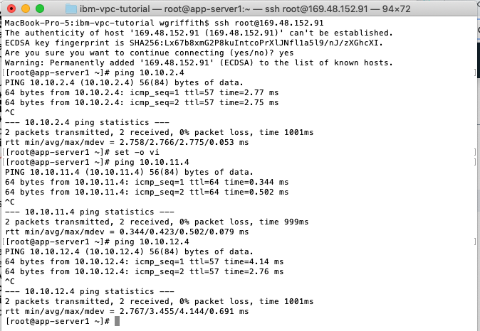  
	* Notice you can ping all private IP addresses (i.e. ``10.10.x.4``) out-of-the-box without setting up any explicit routes.  IBM's VPC uses an implicit router to route traffic across your VPC.
4.  Exit out of ``web1`` and SSH into ``db1`` using ``web1`` as a *jump server* (e.g. ``ssh -J <user>@<jump-server> <user>@<target-server>``) which uses your local private SSH key with the public SSH key that was added to each VSI.  
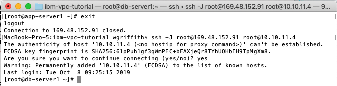
	* Notice that the DB server doesn't have public IP address, so you jumped thru the *Floating IP* of the ``web1`` and then into the *private IP* address of the DB server.
5.  Ping Google's DNS address 8.8.8.8 to verify that you have outbound connectivity thru the *Public Gateway* that you attatched to your subnet.  
6.  Do a ``apt-get update`` to verify that you can update the DB VSI.
7.  Run ``lscpu`` to examine the CPU details of the ``db1``.  
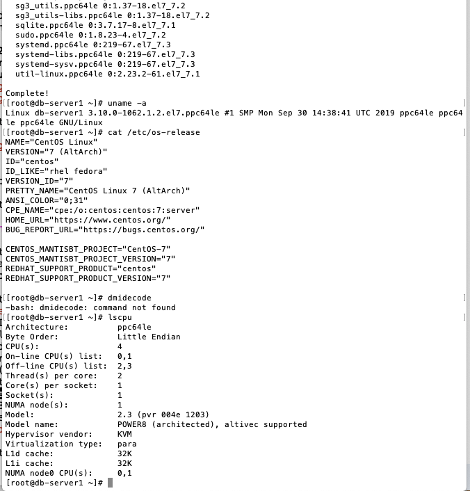
	* Notice that the database server is a POWER9 CPU running the Ubuntu operating system.

### 3.  Install NGinx on the web VSIs
In order to test the load balancer, you will install the NGinx web server on each of the web VSIs.

1. Login to the web VSI and install NGinx. 
```
apt-get update
apt-get -y install nginx
```
2. Add the VSI hostname to the default NGinx home page by editing ``/var/www/html/index.nginx-debian.html`` and add ``on <hostname>`` to the H1 element.  
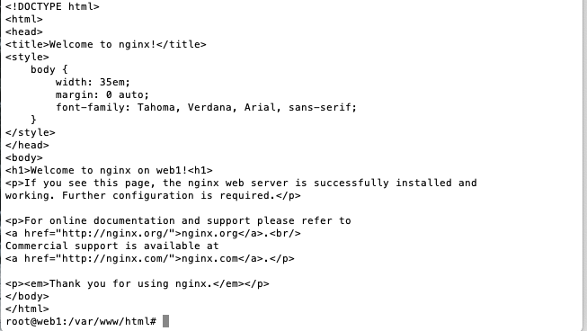

3. Test that NGinx is serving up content with ``curl localhost``.

4. Repeat this process for the remaining web VSIs.

### 4. Configure a VPC Load Balancer  
The IBM Load Balancer for VPC provides the capability to route network traffic across VSIs or applications hosted within your VPC.  It provides proven high availability and ensured performance.  It supports Layer-4 and Layer-7 load balancing across HTTP, HTTPS, and TCP protocols.  It can be configured as a public facing load balaner or a private load balancer.  Many additional advanced features are supported that you can read about [here](https://cloud.ibm.com/docs/vpc?topic=vpc-load-balancers).

1.  From the **VPC Infrastructure** menu, click the **Load balancers** to add a new load balancer to your VPC.  
2.  Click the **New load balancer** link within the Load balancers for VPC page.
3.  Enter a descriptive name for the load balancer (e.g. ``wordpress-loadbalancer``) and ensure the correct VPC is chosen (e.g. ``us-south-dev-vpc``).
4.  Select your desired **Resource group**.
5.  Add desired **Tags**.
6.  Choose the **Region** where you VPC resides.
7.  Choose **Public** as the type of load balancer.
8.  Click the **Subnets** drop-down and choose the 3 ``web`` subnets you previously created. 
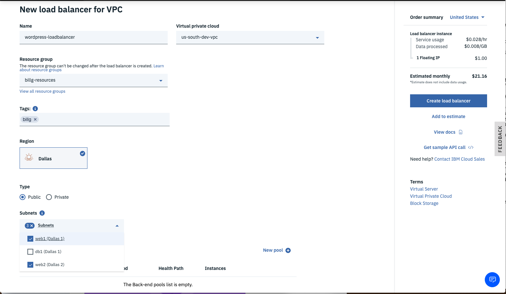
9.  Click the **New pool** link to configure the **Back-end pool** of services this load balancer will route to.
10.  Name the back-end pool (e.g. ``web-servers``) and leave the **Defaults** for the rest then click **Save**.  
11.  Click the **Attach** link to add **Instances** to the **Back-end pool**.
12.  Add the ``web`` subnets and choose the ``web`` VSI in that subnet.  Repeat this for all 3 zones of the MZR, then click the **Attach** button.  
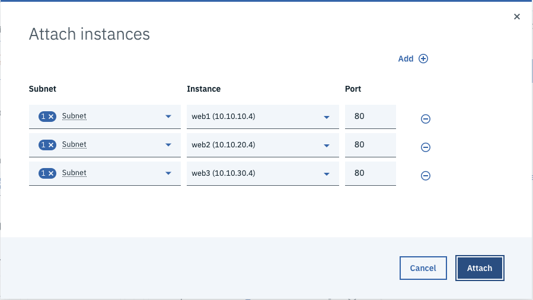
13.  Click the **New listener** link to specify the incoming protocol and port that will get routed to the back-end pool.
14.  Select **HTTP** for the Protocol and enter port ``80`` for the port.
15.  Ensure ``web-servers`` is selected for the Back-end pool, then click **Save**.
16.  Once everything is entered correctly, click the **Create load balancer** button to provision the load balancer.  
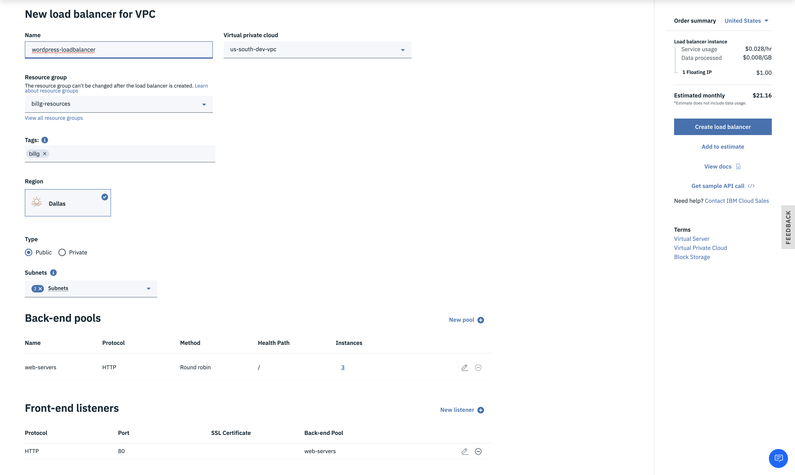

### 5. Test the load balancer.
1.  Drill into the newly created load balancer and notice the **Heath Status** shows **0/3** and is **Red**.  
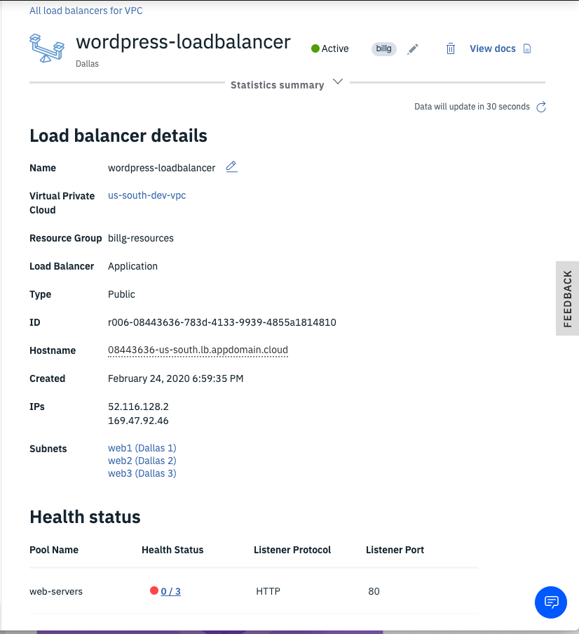
	* The health status is failing as port 80 is blocked by the **default-security-group**.
	* Add an **Inbound rule** for TCP port 80 from any source so you can connect to NGinx.

2.  Go back to your load balancer and watch the **Heath Status** go from **Red** to **Yellow** to **Green**.  
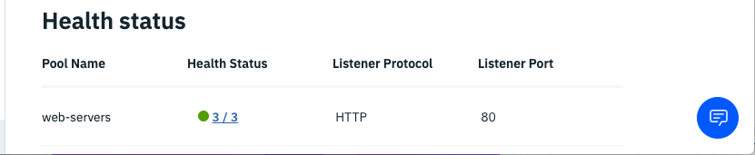

3.  Click the **Hostname** dotted link to copy the public URL.
4.  Paste this URL into your web browser and notice NGinx is serving up the default index page.  

5.  Refresh your browser pointing to the load balancer and notice the H1 element indicates each of the web servers are being routed to in a round-robin fashion.


Congratulations!!!  You have successfully created a software-defined-network using IBM's VPC service where you brought your own custom subnets.  Within those subnets, you provisioned x86 Linux servers and Power9 Linux servers and verified connectivity across the VPC network.  Now you are ready to install some applications and test out load balancing and high availability across multiple data-centers.


##  Disclaimer:
The postings on this site are my own and don't necessarily represent IBM's positions, strategies or opinions.

