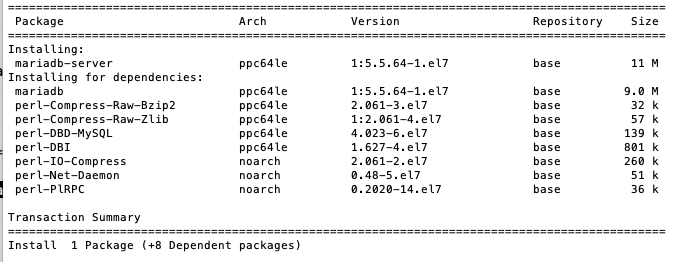

## Install Application Software on VSIs
The following section will be done using the Linux command line interface via an SSH connection. 

https://cloud.ibm.com/docs/tutorials?topic=solution-tutorials-highly-available-and-scalable-web-application#php_application

### 1. Install MariaDB on the db servers
As Wordpress depends on a database, we will start bottom-up to simplify dependencies.

1.  Open two terminals and connect to your each database server (e.g. **db-server1**) via ssh.
```
ssh -J root@169.48.152.91 root@10.10.11.4
ssh -J root@52.116.192.23 root@10.10.21.4
```
2.  Install the MariaDB database on each db VSI.
```
apt-get update
apt-get upgrade  # TODO:  is this needed?
apt-get install -y mariadb-server
```

3.  Start MariaDB 
```
systemctl start mariadb.service
```
4.  Enable MariaDB at server boot time
```
systemctl enable mariadb.service
```
5.  Update security of MariaDB
```
mysql_secure_installation
```
* root password = mariaL0vesVPC
* remove anonymous users = Y
* disallow root login remotely = n
* remove test database = Y
* reload priviledge tables now = Y

6.  Create a database for ``Wordpress``
```
mysql -u root -p
CREATE DATABASE wordpress;
# TODO:  can we use wp_admin instead of root?
GRANT ALL ON wordpress.\* TO root@'10.10.%.%' IDENTIFIED BY 'mariaL0vesVPC' WITH GRANT OPTION;
FLUSH PRIVILEGES;
show databases;
EXIT;
```
7.  Allow VPC network access to MariaDB
```
vi /etc/mysql/mariadb.conf.d/50-server.cnf
[mysqld]
...
bind-address = 0.0.0.0  # TODO:  use 10.10.x.x
...
systemctl restart mariadb.service
- verify MariaDB is listening
netstat --listen --numeric-ports | grep 3306
```
8.  NFS for DB?  Backups?
https://cloud.ibm.com/docs/tutorials?topic=solution-tutorials-highly-available-and-scalable-web-application#database_backup
* backups seem old-school... can I setup replication instead?
	* maybe backups to COS to show COS
* https://cloud.ibm.com/docs/tutorials?topic=solution-tutorials-highly-available-and-scalable-web-application#configure-regular-snapshots

### 2. Setup App Servers 
1.  Install NGINX on the app servers
```
apt-get update
apt-get upgrade  # TODO:  is this needed?
apt-get -y install nginx
apt-get -y install php-fpm php-mysql
# stop php and nginx
systemctl stop php7.2-fpm  # TODO:  why version specific?
systemctl stop nginx
php -v
```
2.  Test web server 

3.  Configure NGINX (https://github.com/billgriffith/tutorial-vpc-3tier-networking/blob/master/WebApp.md#install-php---appserv1)
	* Edit ``/etc/nginx/sites-available/default``
	* add index.php to list of startup pages
	* uncomment FastCGI server config
	```
	# pass the PHP scripts to the local FastCGI server
        location ~ \.php$ {
               include snippets/fastcgi-php.conf;
               fastcgi_pass unix:/run/php/php7.2-fpm.sock;
        }
	```
	* deny access to .htaccess
	```
        location ~ /\.ht {
                deny all;
        }
	```
	* verify NGinX config
	```
	nginx -t
	```
     	* ensure nginx is started
	```
	systemctl start nginx
	systemctl reload nginx
	```
	* test floatingip:
	```
	echo "<?php phpinfo(); ?>" > /var/www/html/info.php
	curl 10.10.2.5/info.php | head
	http://floatingip/info.php
	```
3. Install Wordpress on the app servers
```
apt install php-curl php-gd php-intl php-mbstring php-soap php-xml php-xmlrpc php-zip 
cd /tmp && wget https://wordpress.org/latest.tar.gz
tar -zxvf latest.tar.gz
#mv wordpress /var/www/html/wordpress
cp -r wordpress/\* /var/www/html/
rm -rf wordpress
rm -rf latest.tar.gz
#chown -R www-data:www-data /var/www/html/wordpress
chown -R www-data:www-data /var/www/html/wp-content
#chmod -R 755 /var/www/html/wordpress
chmod -R 755 /var/www/html/wp-content
mv /var/www/html/wordpress/wp-config-sample.php /var/www/html/wordpress/wp-config.php
#chkconfig httpd on  # TODO:  what does this do?
```
4. Configure Wordpress to point to db servers
	* get wordpress secret-keys using ``# curl  https://api.wordpress.org/secret-key/1.1/salt/``
	* copy them into wp-config.php
	* edit ``/var/www/html/wordpress/wp-config.php`` and set the DB parameters
```
define('DB_NAME', 'wordpress');
define('DB_USER', 'root');  # TODO:  can I use db_admin
define('DB_PASSWORD', 'mariaL0vesVPC');
define('DB_HOST', '10.10.12.i');
#define('FS_METHOD', 'direct');  # TODO:  do I need this?

# TODO: test wordpress without doing wp-config.php by copying config file form wordpress home page
https://www.udemy.com/course/aws-certified-solutions-architect-associate/learn/lecture/13887868#overview
```
4.1  Add autoscaling HA
* sync /var/www/html to COS (cross-regional)
* add user-data to pull from COS with new app-server setup
* add wordpress install steps to user-data
* add COS sync (pull from reader) every minute using crontab (``crontab -e``)(https://cloud.ibm.com/docs/cloud-object-storage?topic=cloud-object-storage-rclone)
# */1 * * * * root aws s3 sync --delete /var/www/html s3://mywordpress-code/...  
* add COS sync (push from writer) every minute using crontab (``crontab -e``)(https://cloud.ibm.com/docs/cloud-object-storage?topic=cloud-object-storage-rclone)
# */1 * * * * root aws s3 sync --delete s3://mywordpress-code/...  /var/www/html/wp-content/uploads
# add file to /var/www/html/wp-content/foo  -> verify file appears in COS
* burn above to OS image for autoscaling speed


* point DNS to ELB??


5. Test application configuration
http://floatingIP/wordpress
* configure language
* add user/password
* add wordpress title
* screenshot

Congratulations!!!  You have successfully installed WordPress on a multi-VSI VPC configuration.

## Configure High Availability

### 1. Provision a cross-zone Load Balancer

### 2. Configure health-checks

### 3. Test data-center failure

### 4. Configure database replication

### 5. Test DB failover


